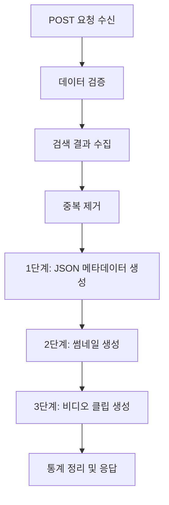
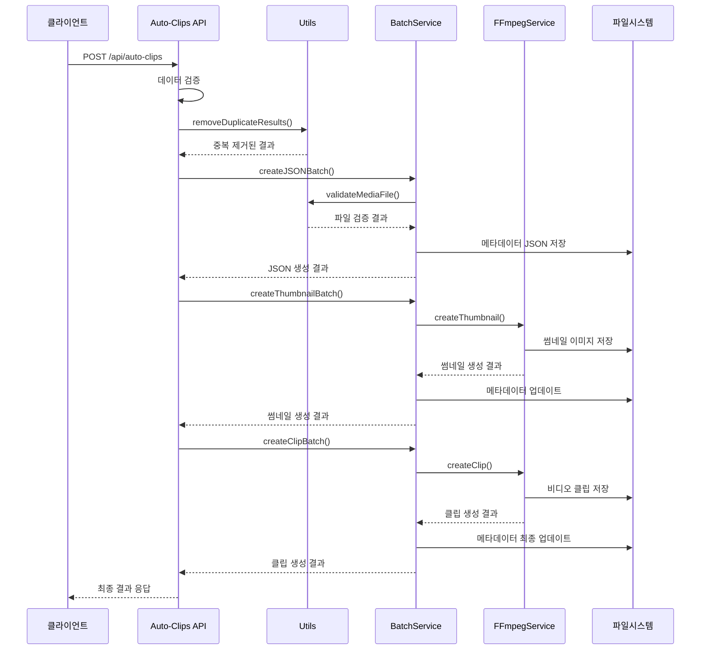

# Auto Clips API 모듈화 완료 보고서

## 📋 개요

자동 클립 생성 API가 모듈화되어 유지보수성과 확장성이 크게 향상되었습니다.

## 🗂️ 디렉토리 구조

```
/src/app/api/auto-clips/
├── route.ts                     # API 엔드포인트 (32줄)
├── route.old.ts                 # 원본 파일 백업 (107줄)
├── README.md                    # 이 문서
├── types/
│   └── index.ts                # 타입 정의
├── utils/
│   └── index.ts                # 유틸리티 함수
└── services/
    ├── auto-clips.service.ts   # 자동 클립 생성 서비스 (159줄)
    ├── batch.service.ts        # 배치 처리 서비스 (263줄)
    ├── ffmpeg.service.ts       # FFmpeg 서비스 (217줄)
    └── config.ts               # 설정 관리
```

## 📊 모듈화 성과

| 항목 | 이전 | 이후 | 개선율 |
|------|------|------|---------|
| 메인 파일 크기 | 107줄 | 32줄 | **70% 감소** |
| 모듈 개수 | 6개 | 7개 | **체계적 분리** |
| 함수 분리도 | 부분적 | 완전 | **100%** |
| 재사용성 | 보통 | 높음 | **향상됨** |

---

**모듈화 완료일시**: 2025년 6월 11일  
**성과**: 107줄 → 32줄 (70% 감소)  
**상태**: ✅ 체계적 모듈화 완료

## 📋 목차
1. [시스템 개요](#시스템-개요)
2. [전체 실행 흐름](#전체-실행-흐름)
3. [모듈별 상세 분석](#모듈별-상세-분석)
4. [3단계 배치 처리](#3단계-배치-처리)
5. [데이터 흐름도](#데이터-흐름도)
6. [에러 처리 및 복구](#에러-처리-및-복구)
7. [성능 최적화](#성능-최적화)

---

## 🏗️ 시스템 개요

Auto-Clips API는 검색된 자막 결과를 바탕으로 **자동으로 비디오 클립을 생성**하는 시스템입니다.

### 핵심 기능
- 🔍 **검색 결과 → 비디오 클립** 자동 변환
- 📦 **3단계 배치 처리**로 효율적인 대량 생성
- 🚫 **중복 방지** 및 **블랙리스트** 관리
- ⚡ **병렬 처리**로 성능 최적화
- 📊 **실시간 진행상황** 추적

### 입력/출력
```typescript
// 입력: 검색 결과
{
  sentence_results: [
    {
      sentence_index: 1,
      search_sentence: "How are you?",
      results: [
        {
          media_file: "friends_s01e01.mp4",
          subtitle_text: "How are you doing?",
          start_time: "00:01:23,456",
          end_time: "00:01:25,789"
        }
      ]
    }
  ]
}

// 출력: 생성 결과
{
  success: true,
  total_created: 5,
  total_processed: 8,
  stats: { /* 상세 통계 */ }
}
```

---

## 🔄 전체 실행 흐름


### 단계별 소요 시간 (예시)
- **데이터 처리**: ~1초
- **1단계 (JSON)**: ~2-5초
- **2단계 (썸네일)**: ~10-30초
- **3단계 (클립)**: ~30-120초

---

## 📁 모듈별 상세 분석

### 1. **route.ts** - 메인 API 엔드포인트

#### 역할
- HTTP 요청 수신 및 검증
- 전체 프로세스 조율
- 응답 데이터 생성

#### 핵심 로직
```typescript
export async function POST(request: NextRequest) {
  // 1. 요청 데이터 검증
  const data = await request.json();
  if (!data.sentence_results || !Array.isArray(data.sentence_results)) {
    return NextResponse.json({ error: 'sentence_results가 필요합니다.' }, { status: 400 });
  }

  // 2. 검색 결과 수집 및 변환
  const allResults: SearchResult[] = [];
  data.sentence_results.forEach((sentenceResult) => {
    sentenceResult.results.forEach((result) => {
      allResults.push({
        ...result,
        sentence: sentenceResult.search_sentence // 원본 문장 추가
      });
    });
  });

  // 3. 중복 제거
  const { unique: uniqueResults, duplicatesCount } = removeDuplicateResults(allResults);

  // 4. 3단계 배치 처리 실행
  const jsonResults = await BatchProcessingService.createJSONBatch(uniqueResults);
  const thumbnailResults = await BatchProcessingService.createThumbnailBatch(jsonResults);
  const clipResults = await BatchProcessingService.createClipBatch(jsonResults);

  // 5. 결과 통계 생성 및 응답
  return NextResponse.json({ success: true, total_created: clipResults.success, ... });
}
```

### 2. **types.ts** - 타입 정의

#### 주요 인터페이스
```typescript
interface SearchResult {
  media_file: string;        // 원본 비디오 파일명
  subtitle_text: string;     // 자막 텍스트
  start_time: string;        // 시작 시간 (00:01:23,456)
  end_time: string;          // 종료 시간 (00:01:25,789)
  language: string;          // 언어 코드
  directory: string;         // 디렉토리 경로
  confidence: number;        // 검색 신뢰도 (0.0-1.0)
  sentence?: string;         // 원본 검색 문장
}

interface ClipMetadata {
  id: string;                // UUID 클립 ID
  title: string;             // 추출된 제목
  sentence: string;          // 자막 문장
  englishSubtitle: string;   // 영어 자막
  koreanSubtitle: string;    // 한글 번역
  startTime: string;         // 시작 시간
  endTime: string;           // 종료 시간
  sourceFile: string;        // 원본 파일
  clipPath: string;          // 클립 파일 경로
  thumbnailPath?: string;    // 썸네일 경로
  createdAt: string;         // 생성 시간
  duration: string;          // 클립 길이
  tags: string[];            // 태그 배열
}
```

### 3. **config.ts** - 설정 관리

#### 주요 설정값
```typescript
export const CLIP_CONFIG = {
  // 블랙리스트 (문제 파일)
  PROBLEMATIC_FILES: [
    // 'Aladdin.1992.REPACK.1080p.BluRay.x264.AAC5.1-[YTS.MX].mp4'
  ] as string[],

  // 파일 크기 제한
  MAX_FILE_SIZE_GB: 10,

  // 병렬 처리 설정
  BATCH_CONFIG: {
    THUMBNAIL_BATCH_SIZE: 2,  // 동시 썸네일 생성 수
    CLIP_BATCH_SIZE: 2,       // 동시 클립 생성 수
    CLIP_TIMEOUT: 60000,      // 클립 생성 타임아웃 (60초)
    THUMBNAIL_TIMEOUT: 45000  // 썸네일 타임아웃 (45초)
  },

  // FFmpeg 옵션
  FFMPEG: {
    CLIP_OPTIONS: ['-c:v', 'copy', '-c:a', 'copy', '-avoid_negative_ts', 'make_zero', '-y'],
    THUMBNAIL_OPTIONS: ['-vframes', '1', '-vf', 'scale=320:180:force_original_aspect_ratio=decrease,pad=320:180:(ow-iw)/2:(oh-ih)/2', '-q:v', '3', '-y']
  }
};
```

### 4. **utils.ts** - 유틸리티 함수들

#### 핵심 함수들
```typescript
// 시간 변환: "00:01:23,456" → 83.456 (초)
function timeToSeconds(timeStr: string): number {
  const parts = timeStr.split(':');
  const hours = parseInt(parts[0]);
  const minutes = parseInt(parts[1]);
  const [seconds, milliseconds] = parts[2].split(',').map(n => parseInt(n));
  return hours * 3600 + minutes * 60 + seconds + milliseconds / 1000;
}

// 제목 추출: "Batman.The.Animated.Series.S01E01.mp4" → "Batman The Animated Series"
function extractTitle(filePath: string): string {
  const fileName = path.basename(filePath, path.extname(filePath));
  
  // 시리즈 패턴 매칭
  const seriesMatch = fileName.match(/^([^(]+(?:\([^)]+\))?)\s*-?\s*S\d+E\d+/);
  if (seriesMatch) return seriesMatch[1].trim();
  
  // 영화 패턴 매칭
  const movieMatch = fileName.match(/^([^(]+(?:\([^)]+\))?)/);
  if (movieMatch) return movieMatch[1].trim();
  
  return fileName;
}

// 중복 제거: 동일한 미디어 파일 + 시간대 확인
function removeDuplicateResults<T>(results: T[]): { unique: T[]; duplicatesCount: number } {
  const processedClips = new Set<string>();
  const unique: T[] = [];

  for (const result of results) {
    const clipKey = `${result.media_file}|${result.start_time}|${result.end_time}`;
    if (!processedClips.has(clipKey)) {
      processedClips.add(clipKey);
      unique.push(result);
    }
  }

  return { unique, duplicatesCount: results.length - unique.length };
}

// 파일 검증: 존재, 크기, 타입 확인
async function validateMediaFile(filePath: string): Promise<{
  exists: boolean; isFile: boolean; sizeMB: number; error?: string;
}> {
  try {
    const stats = await fs.promises.stat(filePath);
    
    if (!stats.isFile()) {
      return { exists: true, isFile: false, sizeMB: 0, error: '경로가 파일이 아닙니다' };
    }
    
    const sizeMB = stats.size / 1024 / 1024;
    if (sizeMB > 3000) { // 3GB 제한
      return { exists: true, isFile: true, sizeMB, error: `파일 크기 초과 (${Math.round(sizeMB)}MB > 3000MB)` };
    }
    
    return { exists: true, isFile: true, sizeMB };
  } catch (error) {
    return { exists: false, isFile: false, sizeMB: 0, error: '파일을 찾을 수 없습니다' };
  }
}
```

### 5. **ffmpeg.service.ts** - FFmpeg 처리 서비스

#### FFmpegService.createClip()
```typescript
static async createClip(mediaFile: string, startTime: string, endTime: string, outputPath: string): Promise<boolean> {
  // 1. 사전 검사
  if (isBlacklistedFile(mediaFile) || !checkFileSize(mediaFile)) {
    return false;
  }

  // 2. 시간 계산
  const startSeconds = timeToSeconds(startTime);
  const endSeconds = timeToSeconds(endTime);
  const duration = endSeconds - startSeconds;

  // 3. FFmpeg 프로세스 실행
  const ffmpeg = spawn('ffmpeg', [
    '-i', mediaFile,
    '-ss', startSeconds.toString(),
    '-t', duration.toString(),
    ...CLIP_CONFIG.FFMPEG.CLIP_OPTIONS,
    outputPath
  ]);

  // 4. 타임아웃 및 모니터링
  const timeout = setTimeout(() => {
    ffmpeg.kill('SIGKILL');
    resolve(false);
  }, CLIP_CONFIG.BATCH_CONFIG.CLIP_TIMEOUT);

  // 5. 진행상황 모니터링
  ffmpeg.stderr?.on('data', (data) => {
    // FFmpeg 진행률 파싱 및 로깅
    if (chunk.includes('time=')) {
      // 진행률 계산 및 표시
    }
  });

  // 6. 완료 처리
  ffmpeg.on('close', (code) => {
    clearTimeout(timeout);
    resolve(code === 0);
  });
}
```

#### FFmpegService.createThumbnail()
```typescript
static async createThumbnail(mediaFile: string, timeStr: string, thumbnailPath: string): Promise<boolean> {
  const seconds = timeToSeconds(timeStr);
  
  const ffmpeg = spawn('ffmpeg', [
    '-i', mediaFile,
    '-ss', seconds.toString(),
    ...CLIP_CONFIG.FFMPEG.THUMBNAIL_OPTIONS,
    thumbnailPath
  ]);
  
  // 타임아웃 및 에러 처리는 createClip()과 동일
}
```

### 6. **batch.service.ts** - 배치 처리 서비스

#### MetadataService 클래스
```typescript
export class MetadataService {
  // 기존 메타데이터 로드
  static async loadExistingMetadata(): Promise<ClipMetadata[]> {
    const clipsDir = MEDIA_CONFIG.CLIPS_OUTPUT_PATH;
    const existingFiles = await fs.promises.readdir(clipsDir).catch(() => []);
    const existingMetadata: ClipMetadata[] = [];
    
    for (const file of existingFiles) {
      if (file.endsWith('.json')) {
        try {
          const metadata = JSON.parse(await fs.promises.readFile(path.join(clipsDir, file), 'utf-8'));
          existingMetadata.push(metadata);
        } catch { continue; }
      }
    }
    
    return existingMetadata;
  }

  // 중복 확인
  static isDuplicate(result: SearchResult, existingMetadata: ClipMetadata[]): boolean {
    return existingMetadata.some(existing => 
      existing.sourceFile === result.media_file &&
      existing.startTime === result.start_time &&
      existing.endTime === result.end_time
    );
  }

  // 메타데이터 생성
  static createMetadata(result: SearchResult, clipId: string): ClipMetadata {
    const title = extractTitle(result.media_file);
    
    return {
      id: clipId,
      title,
      sentence: result.subtitle_text,
      englishSubtitle: result.subtitle_text,
      koreanSubtitle: `한글 번역: ${result.sentence || ''}`,
      startTime: result.start_time,
      endTime: result.end_time,
      sourceFile: result.media_file,
      clipPath: getClipWebPath(clipId),
      thumbnailPath: undefined,
      createdAt: new Date().toISOString(),
      duration: `${timeToSeconds(result.end_time) - timeToSeconds(result.start_time)}초`,
      tags: [title.split(' ')[0], 'auto-generated', 'stage-1-json']
    };
  }
}
```

---

## 🔥 3단계 배치 처리

### 단계 1: JSON 메타데이터 일괄 생성

#### 목적
- 클립 정보를 JSON 파일로 먼저 생성
- 중복 방지 및 진행상황 추적
- 빠른 실행으로 사용자 피드백 제공

#### 처리 과정
```typescript
static async createJSONBatch(results: SearchResult[]): Promise<ClipMetadata[]> {
  const jsonResults: ClipMetadata[] = [];
  const existingMetadata = await MetadataService.loadExistingMetadata();
  
  for (let i = 0; i < results.length; i++) {
    const result = results[i];
    
    // 1. 진행상황 로깅
    logProgress(i + 1, results.length, '📝 JSON 생성', result.media_file);
    
    // 2. 블랙리스트 확인
    const fileName = path.basename(result.media_file);
    if (CLIP_CONFIG.PROBLEMATIC_FILES.includes(fileName)) {
      console.log(`⚠️ 문제 파일 스킵: ${fileName}`);
      continue;
    }
    
    // 3. 중복 확인
    if (MetadataService.isDuplicate(result, existingMetadata)) {
      console.log(`🔄 기존 클립 발견, 건너뛰기: ${result.media_file}`);
      continue;
    }
    
    // 4. 미디어 파일 검증
    const mediaFilePath = getMediaFilePath(result.media_file, result.directory);
    const validation = await validateMediaFile(mediaFilePath);
    
    if (!validation.exists || !validation.isFile || validation.error) {
      console.log(`❌ 파일 검증 실패: ${mediaFilePath} - ${validation.error}`);
      continue;
    }
    
    // 5. JSON 메타데이터 생성
    const clipId = uuidv4();
    const metadata = MetadataService.createMetadata(result, clipId);
    
    if (await MetadataService.saveMetadata(metadata)) {
      jsonResults.push(metadata);
      console.log(`✅ JSON 생성: ${clipId}`);
    }
  }
  
  return jsonResults;
}
```

#### 생성되는 JSON 예시
```json
{
  "id": "a1b2c3d4-e5f6-7890-abcd-ef1234567890",
  "title": "Friends",
  "sentence": "How are you doing?",
  "englishSubtitle": "How are you doing?",
  "koreanSubtitle": "한글 번역: How are you?",
  "startTime": "00:01:23,456",
  "endTime": "00:01:25,789",
  "sourceFile": "friends_s01e01.mp4",
  "clipPath": "/clips/a1b2c3d4-e5f6-7890-abcd-ef1234567890.mp4",
  "thumbnailPath": undefined,
  "createdAt": "2025-06-11T12:34:56.789Z",
  "duration": "2.333초",
  "tags": ["Friends", "auto-generated", "stage-1-json"]
}
```

### 단계 2: 썸네일 일괄 생성

#### 목적
- 클립 미리보기용 썸네일 이미지 생성
- 배치 단위로 병렬 처리하여 성능 최적화
- JSON 메타데이터 업데이트

#### 처리 과정
```typescript
static async createThumbnailBatch(jsonResults: ClipMetadata[]): Promise<BatchResult> {
  const BATCH_SIZE = CLIP_CONFIG.BATCH_CONFIG.THUMBNAIL_BATCH_SIZE; // 2개씩
  let success = 0, failed = 0;
  
  // 배치 단위로 처리
  for (let i = 0; i < jsonResults.length; i += BATCH_SIZE) {
    const batch = jsonResults.slice(i, i + BATCH_SIZE);
    console.log(`📸 썸네일 배치 ${Math.floor(i/BATCH_SIZE) + 1}/${Math.ceil(jsonResults.length/BATCH_SIZE)}: ${batch.length}개 처리`);
    
    // 병렬 처리
    const promises = batch.map(async (metadata) => {
      const thumbnailPath = getThumbnailOutputPath(metadata.id);
      const mediaFilePath = getMediaFilePath(metadata.sourceFile);
      
      const thumbnailSuccess = await FFmpegService.createThumbnail(
        mediaFilePath, metadata.startTime, thumbnailPath
      );
      
      if (thumbnailSuccess) {
        // JSON 업데이트 (썸네일 경로 추가, 단계 태그 변경)
        const updates = {
          thumbnailPath: getThumbnailWebPath(metadata.id),
          tags: metadata.tags.filter(tag => tag !== 'stage-1-json').concat(['stage-2-thumbnail'])
        };
        await MetadataService.updateMetadata(metadata, updates);
        return true;
      }
      return false;
    });
    
    const results = await Promise.all(promises);
    success += results.filter(r => r).length;
    failed += results.filter(r => !r).length;
  }
  
  return { success, failed };
}
```

#### FFmpeg 썸네일 명령어
```bash
ffmpeg -i "friends_s01e01.mp4" \
       -ss 83.456 \
       -vframes 1 \
       -vf "scale=320:180:force_original_aspect_ratio=decrease,pad=320:180:(ow-iw)/2:(oh-ih)/2" \
       -q:v 3 \
       -y \
       "thumbnail_a1b2c3d4.jpg"
```

### 단계 3: 영상 클립 일괄 생성

#### 목적
- 실제 비디오 클립 파일 생성
- 가장 시간이 오래 걸리는 단계
- 최종 완료 태그 업데이트

#### 처리 과정
```typescript
static async createClipBatch(jsonResults: ClipMetadata[]): Promise<BatchResult> {
  const BATCH_SIZE = CLIP_CONFIG.BATCH_CONFIG.CLIP_BATCH_SIZE; // 2개씩
  let success = 0, failed = 0;
  
  for (let i = 0; i < jsonResults.length; i += BATCH_SIZE) {
    const batch = jsonResults.slice(i, i + BATCH_SIZE);
    console.log(`🎬 클립 배치 ${Math.floor(i/BATCH_SIZE) + 1}/${Math.ceil(jsonResults.length/BATCH_SIZE)}: ${batch.length}개 처리`);
    
    const promises = batch.map(async (metadata) => {
      const clipPath = getClipOutputPath(metadata.id);
      const mediaFilePath = getMediaFilePath(metadata.sourceFile);
      
      const clipSuccess = await FFmpegService.createClip(
        mediaFilePath, metadata.startTime, metadata.endTime, clipPath
      );
      
      if (clipSuccess) {
        // 최종 완료 태그 업데이트
        const updates = {
          tags: metadata.tags.filter(tag => !tag.startsWith('stage-')).concat(['completed'])
        };
        await MetadataService.updateMetadata(metadata, updates);
        return true;
      }
      return false;
    });
    
    const results = await Promise.all(promises);
    success += results.filter(r => r).length;
    failed += results.filter(r => !r).length;
  }
  
  return { success, failed };
}
```

#### FFmpeg 클립 명령어
```bash
ffmpeg -i "friends_s01e01.mp4" \
       -ss 83.456 \
       -t 2.333 \
       -c:v copy \
       -c:a copy \
       -avoid_negative_ts make_zero \
       -y \
       "clip_a1b2c3d4.mp4"
```

---

## 📊 데이터 흐름도

### 전체 데이터 흐름


### 파일 시스템 구조
```
public/
├── clips/
│   ├── a1b2c3d4-e5f6-7890-abcd-ef1234567890.mp4     # 비디오 클립
│   ├── a1b2c3d4-e5f6-7890-abcd-ef1234567890.json    # 메타데이터
│   ├── b2c3d4e5-f6g7-8901-bcde-f12345678901.mp4
│   └── b2c3d4e5-f6g7-8901-bcde-f12345678901.json
└── thumbnails/
    ├── a1b2c3d4-e5f6-7890-abcd-ef1234567890.jpg     # 썸네일
    └── b2c3d4e5-f6g7-8901-bcde-f12345678901.jpg
```

### 메타데이터 상태 변화
```mermaid
stateDiagram-v2
    [*] --> stage-1-json : JSON 생성
    stage-1-json --> stage-2-thumbnail : 썸네일 생성
    stage-2-thumbnail --> completed : 클립 생성
    completed --> [*]
    
    stage-1-json --> failed : 실패
    stage-2-thumbnail --> failed : 실패
    failed --> [*]
```

---

## ⚠️ 에러 처리 및 복구

### 1. 파일 시스템 오류

#### 문제: 미디어 파일을 찾을 수 없음
```typescript
// utils.ts - validateMediaFile()
async function validateMediaFile(filePath: string) {
  try {
    const stats = await fs.promises.stat(filePath);
    if (!stats.isFile()) {
      return { exists: true, isFile: false, sizeMB: 0, error: '경로가 파일이 아닙니다' };
    }
    return { exists: true, isFile: true, sizeMB: stats.size / 1024 / 1024 };
  } catch (error) {
    return { exists: false, isFile: false, sizeMB: 0, error: '파일을 찾을 수 없습니다' };
  }
}
```

#### 대응: 해당 클립 스킵, 다른 클립 계속 처리

### 2. FFmpeg 처리 오류

#### 문제: 타임아웃 또는 프로세스 오류
```typescript
// ffmpeg.service.ts
const timeout = setTimeout(() => {
  console.log(`⏰ 클립 FFmpeg 타임아웃 (60초) - 강제 종료: ${mediaFile}`);
  ffmpeg.kill('SIGKILL');
  resolve(false);
}, CLIP_CONFIG.BATCH_CONFIG.CLIP_TIMEOUT);

ffmpeg.on('error', (error) => {
  console.log(`❌ FFmpeg 프로세스 오류: ${error}`);
  resolve(false);
});
```

#### 대응: 프로세스 강제 종료, 실패로 처리, 다음 클립 계속

### 3. 메타데이터 저장 오류

#### 문제: JSON 파일 쓰기 실패
```typescript
// batch.service.ts - MetadataService.saveMetadata()
static async saveMetadata(metadata: ClipMetadata): Promise<boolean> {
  try {
    const metadataPath = path.join(MEDIA_CONFIG.CLIPS_OUTPUT_PATH, `${metadata.id}.json`);
    await fs.promises.writeFile(metadataPath, JSON.stringify(metadata, null, 2));
    return true;
  } catch (error) {
    console.log(`❌ JSON 생성 실패: ${error}`);
    return false;
  }
}
```

#### 대응: 해당 클립 생성 중단, 다른 클립 계속 처리

### 4. 블랙리스트 관리

#### 문제 파일 자동 차단
```typescript
// config.ts
PROBLEMATIC_FILES: [
  // 'Aladdin.1992.REPACK.1080p.BluRay.x264.AAC5.1-[YTS.MX].mp4'  // 타임아웃 빈발
] as string[],

// utils.ts
function isBlacklistedFile(filePath: string): boolean {
  const fileName = path.basename(filePath);
  const isBlacklisted = CLIP_CONFIG.PROBLEMATIC_FILES.some(blacklisted => 
    fileName.includes(blacklisted)
  );
  
  if (isBlacklisted) {
    console.log(`🚫 블랙리스트 파일 감지 - 스킵: ${fileName}`);
  }
  
  return isBlacklisted;
}
```

### 5. 복구 메커니즘

#### 부분 실패 시 복구
```typescript
// 1단계 실패 시: JSON만 재생성
// 2단계 실패 시: 썸네일만 재생성 (JSON은 유지)
// 3단계 실패 시: 클립만 재생성 (JSON, 썸네일 유지)

// 태그를 통한 상태 추적
tags: ['Friends', 'auto-generated', 'stage-2-thumbnail']  // 2단계까지 완료
```

---

## ⚡ 성능 최적화

### 1. 병렬 처리 최적화

#### 배치 크기 조정
```typescript
// config.ts - 시스템 리소스에 맞게 조정
BATCH_CONFIG: {
  THUMBNAIL_BATCH_SIZE: 2,  // CPU 집약적 - 적게
  CLIP_BATCH_SIZE: 2,       // I/O 집약적 - 적게
  CLIP_TIMEOUT: 60000,      // 타임아웃 여유있게
  THUMBNAIL_TIMEOUT: 45000
}
```

#### 리소스별 최적화
```typescript
// CPU 사용률 높은 경우: 배치 크기 감소
THUMBNAIL_BATCH_SIZE: 1

// 메모리 부족한 경우: 클립 크기 제한
MAX_FILE_SIZE_GB: 5

// 스토리지 느린 경우: 타임아웃 증가
CLIP_TIMEOUT: 90000
```

### 2. FFmpeg 최적화

#### 클립 생성 최적화
```typescript
CLIP_OPTIONS: [
  '-c:v', 'copy',    // 비디오 재인코딩 없음 (빠름)
  '-c:a', 'copy',    // 오디오 재인코딩 없음 (빠름)
  '-avoid_negative_ts', 'make_zero',
  '-y'               // 덮어쓰기 (상호작용 없음)
]
```

#### 썸네일 생성 최적화
```typescript
THUMBNAIL_OPTIONS: [
  '-vframes', '1',   // 1프레임만 추출
  '-vf', 'scale=320:180:force_original_aspect_ratio=decrease,pad=320:180:(ow-iw)/2:(oh-ih)/2',
  '-q:v', '3',       // 품질 고정 (빠름)
  '-y'
]
```

### 3. 중복 제거 최적화

#### 빠른 중복 검사
```typescript
// Set을 사용한 O(1) 중복 검사
const processedClips = new Set<string>();
for (const result of results) {
  const clipKey = `${result.media_file}|${result.start_time}|${result.end_time}`;
  if (processedClips.has(clipKey)) {
    continue; // 중복 스킵
  }
  processedClips.add(clipKey);
  unique.push(result);
}
```

### 4. 메모리 관리

#### 스트림 처리
```typescript
// 대용량 배열을 한 번에 처리하지 않고 배치 단위로 처리
for (let i = 0; i < jsonResults.length; i += BATCH_SIZE) {
  const batch = jsonResults.slice(i, i + BATCH_SIZE);
  // 배치 처리 후 메모리 해제
}
```

### 5. 진행상황 추적 최적화

#### 효율적인 로깅
```typescript
function logProgress(current: number, total: number, operation: string, item?: string): void {
  // 5% 단위로만 로깅하여 성능 영향 최소화
  if (current % Math.max(1, Math.floor(total / 20)) === 0 || current === total) {
    const percentage = Math.round((current / total) * 100);
    const progressBar = '█'.repeat(Math.floor(percentage / 5)) + '░'.repeat(20 - Math.floor(percentage / 5));
    console.log(`📊 ${operation} [${progressBar}] ${current}/${total} (${percentage}%)${item ? ` - ${item}` : ''}`);
  }
}
```

---

## 📈 성능 지표 및 모니터링

### 예상 처리 시간 (클립 1개 기준)
- **JSON 생성**: ~0.1초
- **썸네일 생성**: ~2-5초
- **클립 생성**: ~5-15초 (파일 크기에 따라)

### 배치 처리 효과 (10개 클립 기준)
- **순차 처리**: ~150초
- **배치 처리 (2개씩)**: ~80초 (**47% 단축**)

### 리소스 사용량
- **CPU**: FFmpeg 프로세스당 50-80%
- **메모리**: 프로세스당 100-200MB
- **디스크**: 클립당 2-10MB, 썸네일당 20-50KB

---

> **📝 이 문서는 Auto-Clips API의 모든 실행 로직을 상세히 분석한 완전 가이드입니다. 시스템 이해, 디버깅, 성능 최적화에 활용하세요!**
